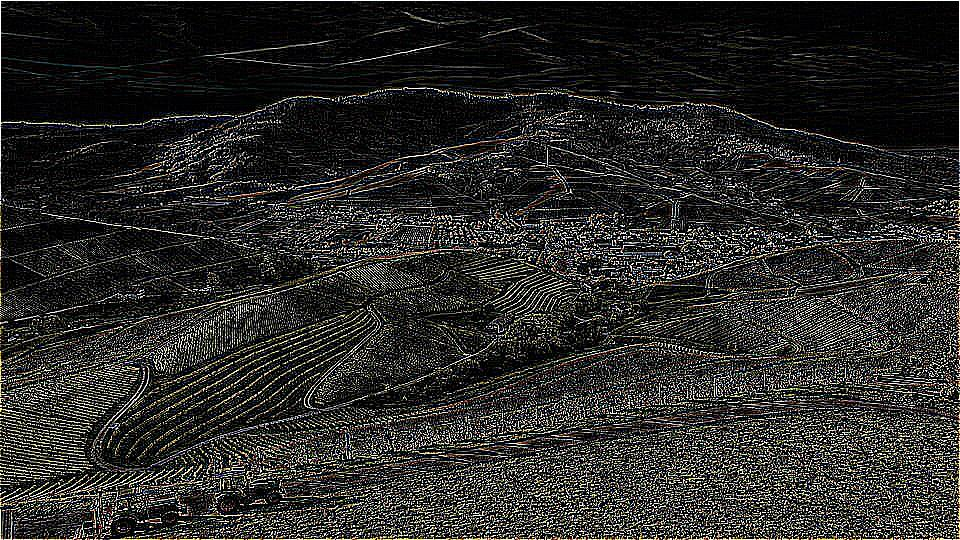
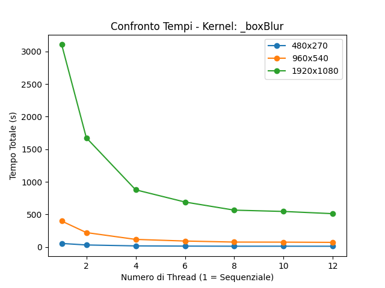
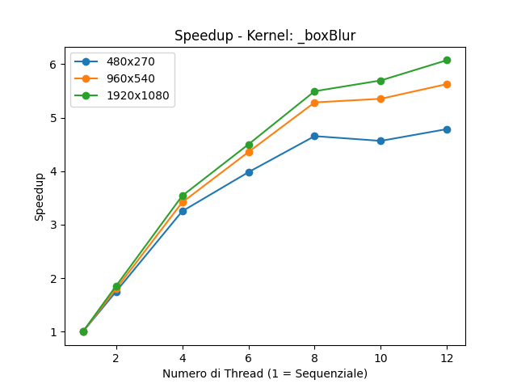

# **Parallel Image Processing with Convolution Kernels**

## 📌 Overview
Questo progetto implementa un'applicazione di **elaborazione parallela di immagini** utilizzando **convoluzioni con kernel**. Il codice applica diversi filtri di trasformazione su immagini di varie risoluzioni, misurando le prestazioni tra l'elaborazione **sequenziale** e quella **parallela** con più thread.

## ⚡ Features
- **Filtri di convoluzione** predefiniti come Edge Detection, Gaussian Blur, Sharpen, ecc.
- **Elaborazione sequenziale e parallela** per il confronto delle performance.
- **Benchmarking automatico** con diverse risoluzioni di immagine e numero di thread.
- **Grafici di analisi** del tempo di esecuzione e dello speedup.
<p align="center">
    
</p>
<p align="center">
    
</p>
## 🛠 Project Structure
```
├── Kernel.py               # Definizione dei kernel di convoluzione
├── main.py                 # Codice principale per l'esecuzione e benchmarking
├── resizeImage.py          # Implementazione dell'elaborazione sequenziale
├── resizeImageParallel.py  # Implementazione dell'elaborazione parallela
├── output.txt              # Output con i risultati delle esecuzioni
├── Risultati/              # Cartella contenente i grafici generati
└── image/                  # Cartella con le immagini di input
```

## 🖥 Installation & Requirements
🔹 **Prerequisiti:**
- Python 3.x
- Librerie necessarie:
  ```bash
  pip install numpy pillow matplotlib
  ```

## 🚀 Usage
Per eseguire il codice ed elaborare le immagini:
```bash
python main.py
```
I risultati saranno salvati in `output.txt` e i grafici in `Risultati/`.

## 📊 Results
Il progetto genera grafici che mostrano:
1. **Execution Time vs. Threads:** confronto del tempo totale tra elaborazione sequenziale e parallela.
2. **Speedup:** rapporto tra il tempo sequenziale e il tempo parallelo in base ai thread.
<p align="center">
    
</p>
<p align="center">
    
</p>


## 🎯 Performance Analysis
- L'incremento del numero di thread **riduce significativamente il tempo di esecuzione**.
- Lo **speedup aumenta fino a un certo punto**, oltre il quale il **limite hardware e l'overhead di gestione dei thread** riducono i benefici.
- Filtri con kernel più complessi (es. **Gaussian 5x5, Unsharp Masking**) mostrano **maggiore accelerazione** grazie al parallelismo.

## 🏆 Conclusions
L'implementazione parallela mostra un **chiaro miglioramento delle prestazioni** rispetto a quella sequenziale, specialmente per immagini di grandi dimensioni e filtri computazionalmente intensivi.
